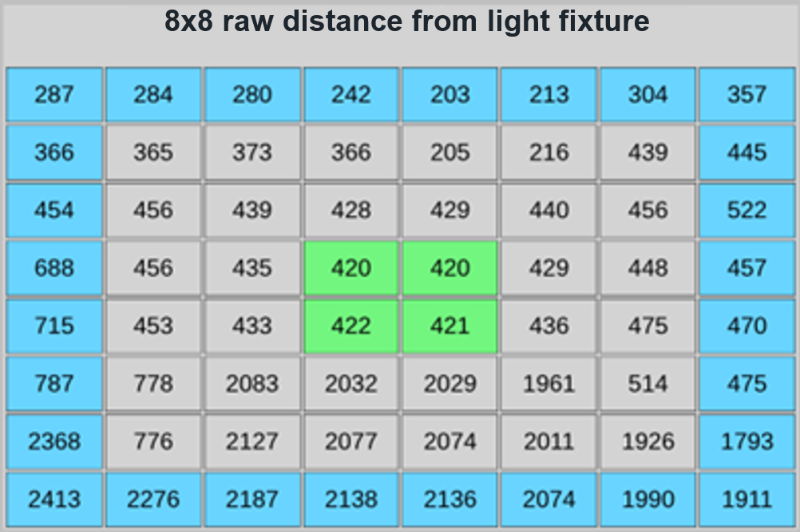
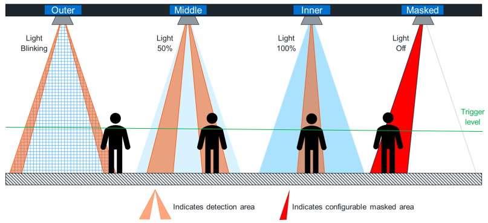
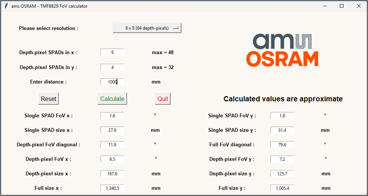
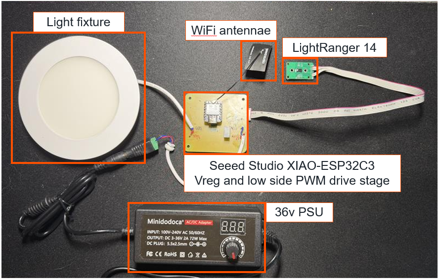
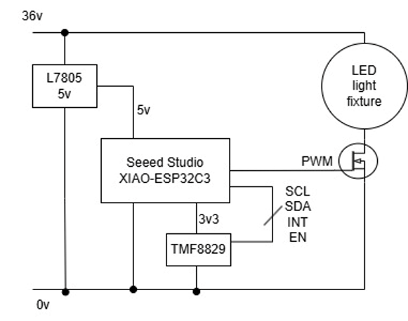
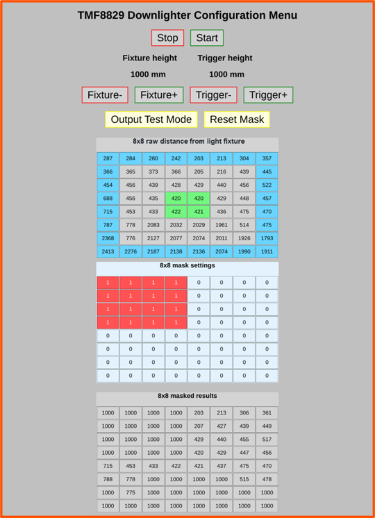

# TMF8829 Downlighter Demo

This demo uses the TMF8829 48x32 direct Time-of-Flight (dToF) sensor https://ams-osram.com/tmf8829 in conjunction with a Seeed Studios XIAO-ESP32C3 https://wiki.seeedstudio.com/XIAO_ESP32C3_Getting_Started/, dc-dc converter and low side FET drivers to create an intelligent downlighter demonstrator.

The TMF8829 sensor is configured in an 8x8 mode with 3 sensing zones as shown below.




When an object is detected within one of the detection zones the relevant lighting effect will be triggered unless masked.




A zone size calculation utility may be downloaded from GitHub https://github.com/ams-OSRAM/tmf8829_FoV_Zone_Size_Calculator_App




## Hardware

The image below shows the prototype hardware setup.




Here is the simplified schematic for the system.




## WiFi interface

The ESP32C3 generates a WiFI access point, the default connection details are shown below.

```sh 

const char *ssid = "TMF8829_Downlighter";
const char *password = "TTMMFF88882299";

```

When connected you can navigate to this page using your browser.




The system can be started and stopped and fixture and Trigger height settings may be changed by clicking the appropriate button.

Clicking the "Output Test Mode" button may be used to toggle through the 4 output stages, "OFF", "BLINKING", "50% INTENSITY LIGHTING" & "100% INTENSITY LIGHTING".

The sensor mask may be reset by clicking the "Reset Mask" button.

## ESP32C3 firmware

The ESP32C3 firmware is based on the TMF8829 Arduino Driver https://github.com/ams-OSRAM/tmf8829_driver_arduino developed under Arduino IDE 2.3.10

It contains the following files:
 - tmf8829.ino - the Arduino specific wrapper for the application
 - tmf8829_app.h and tmf8829_app.cpp - the tmf8829 DOwnlighter Demo Example application
 - tmf8829.h and tmf8829.c - the tmf8829 driver
 - tmf8829_shim.h and tmf8829_shim.cpp - a shim to abstract the Arduino specific I2C, UART and GPIO functions
 - tmf8829_image.h and tmf8829_image.c - the tmf8829 firmware that is downloaded by the driver as a c-struct

Please refer to the Arduino Driver Repo for further details on the driver

TO assist with debug, the ESP32C3 can also connect to a UART terminal host via USB (115200 baud)

The following commands are implemented 
```sh
  "m / M ... measure"
  "s / S ... stop"
  "f / F ... fixture height + 25cm, (max 500cm)"
  "l / L ... fixture height - 25cm, (max 500cm)"
  "i / I ... trigger distance + 25cm (max 500cm)";
  "d / D ... trigger distance - 25cm (min 25cm)"
  "a / A ... mask all zones"
  "u / U ... un-mask all zones"
  "y / Y ... read zone mask"
  "z / Z ... zone mask increment"
  "w / W ... zone mask set"
  "o / O ... output test"
```

